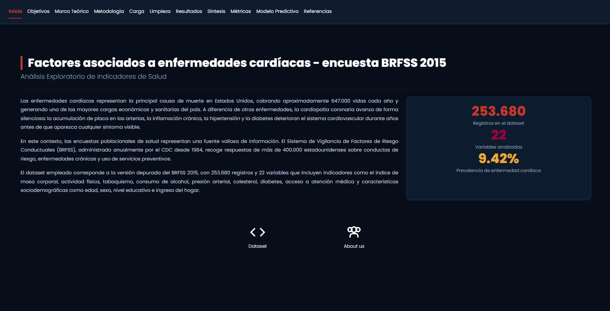

# Análisis Exploratorio de Indicadores de Salud y Factores Asociados a Enfermedades Cardíacas — BRFSS 2015



## Descripción

Este proyecto presenta un análisis exploratorio de datos (EDA) sobre los factores conductuales, clínicos y sociodemográficos asociados al riesgo de enfermedad cardíaca en adultos estadounidenses, utilizando la encuesta BRFSS 2015 del CDC. El análisis fue desarrollado como un dashboard interactivo construido con R y la librería Shiny.

El dataset empleado contiene 253.680 registros y 22 variables que incluyen indicadores como el índice de masa corporal, actividad física, tabaquismo, consumo de alcohol, presión arterial, colesterol, diabetes, acceso a atención médica y características sociodemográficas.

---

## Estructura del proyecto

```
shiny_app/
├── app.R
├── docs/
│   |── heart_disease_health_indicators_BRFSS2015.csv  ← copiar aquí
|   ├── inicio.png
└── R/
    ├── home.R, objetivos.R, marco_teorico.R
    ├── metodologia.R, carga.R, limpieza.R
    ├── resultados.R, metricas.R, modelo.R,sintesis.R, referencias.R
```

---

## Requisitos

- **R 4.3+**: https://cran.r-project.org/
- **RStudio** (opcional): https://posit.co/download/rstudio-desktop/

---

## Instalar paquetes (una sola vez)

```r
install.packages(c("shiny","bslib","DT","plotly","dplyr","readr"))
```

---

## Ejecutar la app

**Opción A — RStudio:**
Abre `app.R` → clic en "Run App"

**Opción B — Consola R:**
```r
setwd("ruta/a/shiny_app")
shiny::runApp()
```

**Opción C — Ruta directa:**
```r
shiny::runApp("ruta/completa/a/shiny_app")
```

## Dataset

Los datos provienen del **Behavioral Risk Factor Surveillance System (BRFSS) 2015**, administrado por el CDC. La versión depurada utilizada en este proyecto fue publicada en Kaggle por Alex Teboul.

- [Ver dataset en Kaggle](https://www.kaggle.com/datasets/alexteboul/heart-disease-health-indicators-dataset/data)
- [Ver fuente original CDC](https://www.cdc.gov/brfss/annual_data/annual_2015.html)
- [Ver Dashboad en tu navegador](https://77nb09-camilo0andr0s-mujica0escorcia.shinyapps.io/heart-disease-dashboard/)
## Equipo

Este proyecto fue desarrollado por:

- **Natalia Alvarado** — [GitHub](https://github.com/paolacorr67-ctrl)
- **Camilo Mujica** — [GitHub](https://github.com/camilo0709)
